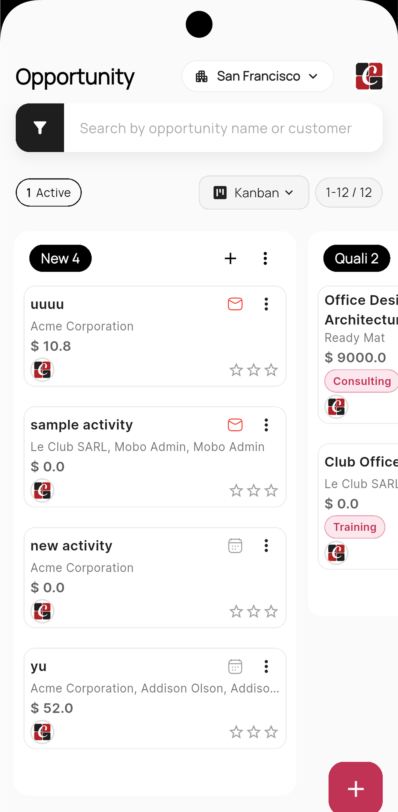
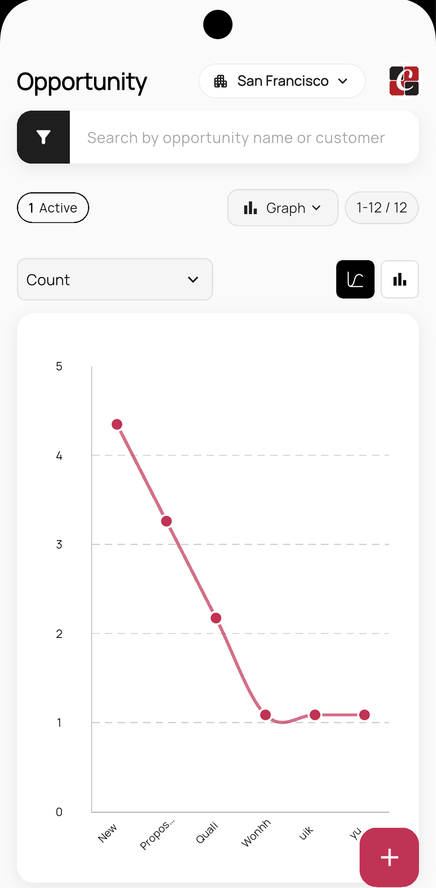
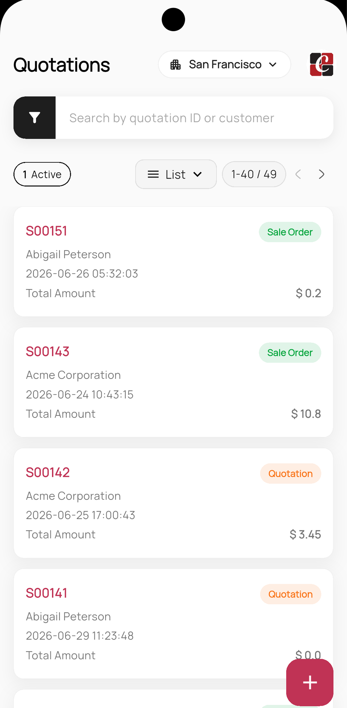
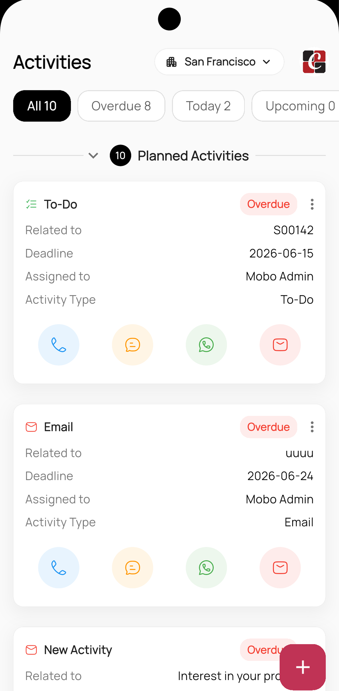
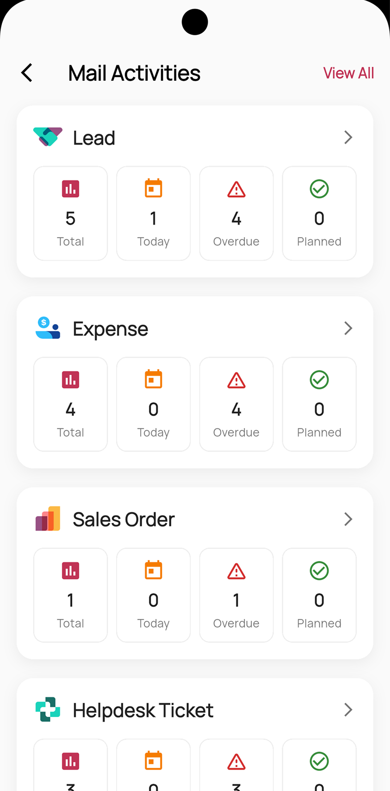

# Mobo CRM for Odoo


Mobo CRM for Odoo is a full-featured mobile CRM that brings your Odoo sales pipeline to Android and iOS. Built with Flutter, it lets sales teams manage leads, opportunities, customers, quotations, and activities on the go — with real-time synchronization to your Odoo backend, offline caching, and an in-app team chat.

##  Key Features

###  Sales Pipeline
- **Lead Management**: Capture, qualify, and convert leads with detailed forms and grouped list views.
- **Opportunity Pipeline**: Visualize your sales funnel with a drag-and-drop Kanban board organized by stage.
- **Quotations**: Build, edit, and track sales quotations, with filtering and professional PDF generation.
- **Invoicing**: Create and review customer invoices directly from the app.

###  Customers & Insights
- **Customer Management**: Maintain rich customer profiles with contact details and history.
- **Interactive Maps**: Capture and save customer locations using integrated geolocation and mapping.
- **Analytics Dashboard**: Real-time visualization of pipeline and sales performance using `fl_chart` and Syncfusion charts.

###  Activities & Collaboration
- **Activity Management**: Schedule, track, and complete activities with a calendar view and reminder overlays.
- **My Activities**: A personalized workspace for your assigned to-dos and mail.
- **Team Discuss / Chat**: Real-time messaging with channels, group conversations, and `@` mentions.

###  Security & Access
- **Secure Authentication**: Session-based login with database selection and 2FA/TOTP support.
- **Biometric Security**: Quick, secure access via Fingerprint or Face ID.
- **Encrypted Storage**: Sensitive credentials stored via `flutter_secure_storage`.
- **Switch Account**: Effortlessly toggle between different user accounts.
- **Self-Signed Certificates**: Support for connecting to servers with self-signed SSL certificates.

###  System & Integration
- **Real-Time Sync**: Two-way synchronization with your Odoo server over JSON-RPC.
- **Offline Support**: Local caching with Isar keeps your data available without a connection.
- **Multi-Company Support**: Seamlessly operate across different Odoo company profiles.
- **Cross-Platform**: Consistent experience across Android and iOS.

##  App Demo

<p align="center">
  
  
  
  
  
</p>

*Visual preview of the Mobo CRM opportunity pipeline, analytics, quotations, and activity screens.*

##  Technology Stack

- **Frontend**: Flutter (Dart)
- **State Management**: Provider
- **Backend Integration**: Odoo RPC (`odoo_rpc`) over JSON-RPC
- **Offline Storage**: Isar (`isar_community`)
- **Charts & Data**: `fl_chart` and Syncfusion (charts, calendar, datagrid)
- **Documents**: PDF generation and printing (`pdf`, `printing`)
- **Location**: `geolocator`, `geocoding`
- **Security**: `flutter_secure_storage`, `local_auth`

##  Platform Support

- **Android**: 7.0 (API level 24) and above
- **iOS**: 15.5 and above

### Permissions
The app may request:
- **Internet Access**: For Odoo server synchronization.
- **Location**: For selecting and saving customer addresses on the map.
- **Camera / Photos**: For customer and profile images.
- **Storage**: For PDF generation and sharing.
- **Biometrics**: For fingerprint / Face ID login.

##  Project Structure

```
lib/
├── auth/              # Authentication flow and biometric auth
├── core/              # Colors, navigation, security, multi-company, providers
├── global_methods/    # Shared bottom sheets, dialogs, overlays, widgets, utils
├── models/            # Data models (activities, chat, quotations, Isar entities)
├── providers/         # App-wide providers
├── screens/           # Feature UI (lead, opportunity, customers, quotation,
│                      #   invoice, activities, dashboard, discuss, settings...)
├── services/          # Odoo RPC, auth, network, and storage services
├── utils/             # Shared utilities and globals
└── main.dart          # App entry point and provider setup
```

##  Getting Started

### Prerequisites
- [Flutter SDK](https://docs.flutter.dev/get-started/install) (Dart SDK `>=3.4.4 <4.0.0`)
- Odoo Instance (Tested Versions: 14 - 19)
- Android Studio / VS Code

### Installation

1. **Clone the repository**
   ```bash
   git clone https://github.com/mobo-open-source/mobo_crm.git
   cd mobo_crm
   ```

2. **Install dependencies**
   ```bash
   flutter pub get
   ```

3. **Run the application**
   ```bash
   flutter run
   ```

> **Note:** Generated Isar database code (`*.g.dart`) is committed, so no code generation is needed to run the app. If you modify any Isar model, regenerate it with:
> ```bash
> dart run build_runner build --delete-conflicting-outputs
> ```

##  Configuration

1. **Server Setup**: Enter your Odoo Server URL and select a database on the login screen.
2. **Credentials**: Log in with your standard Odoo user credentials (2FA/TOTP supported).
3. **Company Selection**: Switch between allowed companies from the profile menu.

##  Troubleshooting

- **Connection Error**: Ensure your server URL is correct (use `https://`) and Odoo is reachable. For self-signed certificates, verify the certificate is accepted.
- **Login Issues**: Verify your database name and that the user has the appropriate CRM/Sales permissions in Odoo.
- **Build Runner Errors**: If you edit Isar models, run `dart run build_runner build --delete-conflicting-outputs` to regenerate the database code.

##  Roadmap
- **Push Notifications**: Real-time alerts for new activities and messages.
- **Offline Editing**: Full create/edit support while offline with automatic sync.
- **Advanced Reporting**: Additional dashboard widgets and exportable reports.
- **Attachment Support**: Richer document and image handling on records.

##  License
See the [LICENSE](LICENSE) file for the main license and [THIRD_PARTY_LICENSES.md](THIRD_PARTY_LICENSES.md) for details on included dependencies and their respective licenses.

##  Maintainers
**Team Mobo at Cybrosys Technologies**
- Email: [mobo@cybrosys.com](mailto:mobo@cybrosys.com)
- Website: [cybrosys.com](https://www.cybrosys.com)
